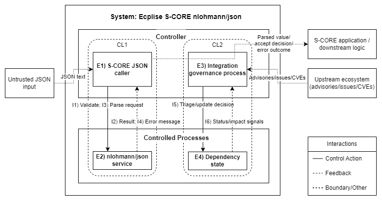

## Risk Analysis for nlohmann/json 3.12.0 within eclipse-score/nlohmann_json

This document provides a **risk analysis** for the **eclipse-score/nlohmann_json** repository following the risk analysis approach of the Trustable Software Framework (TSF) \[[RAFIA: Risk Analysis](https://pages.eclipse.dev/eclipse/tsf/tsf/extensions/rafia/risk-analysis.html)\].

## 0. Methodology (RAFIA / STPA) – What is being done and why

Risk Analysis objectives (summarised from the Codethink guidance) are:

- **Hazard analysis**
  - Describe a *system/subsystem* that incorporates the software.
  - Identify *Losses* (unacceptable outcomes) and *Hazards* (system-level conditions leading to losses).
  - Specify a *control structure* (controllers, controlled processes, control actions, feedback).
  - Identify *Unsafe Control Actions (UCAs)* that may result in hazards.
  - Identify *Causal Scenarios* that can lead to UCAs or hazards.
  - Devise *Constraints* that must hold to avoid hazards/UCAs/scenarios.
- **Traceability**
  - Map analysis outcomes into the TSF model of Statements: *Expectations*, *Assertions*, *Evidence*.
  - Maintain forward/backward links so that changes to any statement trigger re-evaluation of related analysis links.
- **Risk evaluation**
  - Evaluate relative importance of hazards/misbehaviours using at least **severity** and **likelihood**, and optionally **controllability** and **exposure/demand**, to support prioritisation and cost/benefit decisions \[[RAFIA: Risk Analysis](https://pages.eclipse.dev/eclipse/tsf/tsf/extensions/rafia/risk-analysis.html)\].

### How this is instantiated for this repository

This repository already contains a rich TSF statement graph that captures:

- the **expected behaviours** (`JLEX-01`, `JLEX-02`) and their supporting evidence (`WFJ-*`, `PJD-*`, `NJF-*`, `NPF-*`, `TIJ-*`), and
- the process expectations around tests, fixes, inputs, constraints, and analysis (`TA-TESTS`, `TA-FIXES`, `TA-INPUTS`, `TA-CONSTRAINTS`, `TA-ANALYSIS`, …).

### STPA procedure and schema conformance

This document follows the RAFIA STPA procedure at the level of intent and outputs (Losses → Hazards → Control Structure → UCAs → Scenarios → Constraints → Misbehaviours), as described in the TSF extensions:

- STPA procedure: \[[RAFIA STPA Procedure](https://pages.eclipse.dev/eclipse/tsf/tsf/extensions/stpa/procedure.html)\]
- STPA workbook schema (tables/columns): \[[STPA results schema](https://pages.eclipse.dev/eclipse/tsf/tsf/extensions/stpa/schema.html)\]

---

## 1. Scope and System Context

The system boundary, environment, and boundary-crossing interactions assumed for this scope are summarised in the control structure diagram in Section 3.0.

### 1.1 Software Under Analysis

The software under analysis (SUA) is the **header-only C++ JSON library `nlohmann/json` (v3.12.0)**, with:

- **Implementation**
  - primary include `include/nlohmann/json.hpp` (and internal headers under `include/nlohmann/detail/**`)
  - optional amalgamated single-include header `single_include/nlohmann/json.hpp`
  - C++11, no external code dependencies
- **Purpose**
  - provide JSON parsing and validation per **RFC 8259**
- **Evidence**
  - captured extensively in `WFJ-*`, `TIJ-*`, `NJF-*`, `NPF-*`, and `PJD-*` statements, which are connected in the trustable graph to the expectations `JLEX-01` and `JLEX-02`.

In practical terms, this means the “safety envelope” of the component is defined by the combination of:

- the semantic scope of RFC 8259 JSON (what inputs are considered valid JSON), and
- the repository’s explicit expectations (`JLEX-01`, `JLEX-02`) and their evidence families.

### 1.2 Integration Context (as documented by TSF expectations)

This repository’s TSF Expectations explicitly scope the intended integration context to:

- JSON validation (`JLEX-01`, referencing the S-CORE JSON Validation requirement), and
- JSON deserialization (`JLEX-02`, referencing the S-CORE JSON Deserialization requirement).

In the remainder of this document, “S-CORE” is used as a **target-system / integrator label** for expressing system-level Losses and Hazards in the STPA sense. This repository itself documents the `nlohmann/json` component and its TSF statement graph.

The TSF graph shows this as:

- `TT-EXPECTATIONS` → `TA-BEHAVIOURS` → `JLEX-01`, `JLEX-02`
- `TA-INPUTS` → multiple `JLS-*` (e.g. `JLS-34`, `JLS-48`, `JLS-49`, `JLS-50`), describing properties of inputs, dependencies and environment.

The library **does not control hardware directly**. Misbehaviours affect S-CORE only **via incorrect JSON validation or parsing**, influencing higher-level functions.

Because this is a *library component*, we express risks at the S-CORE system level (e.g., “S-CORE accepts ill-formed JSON”), and we treat the library as a contributing factor through its API behaviour and error signalling. This matches the RAFIA/STPA guidance to analyse the software in the context of a system/subsystem, rather than as an isolated artifact \[[RAFIA: Risk Analysis](https://pages.eclipse.dev/eclipse/tsf/tsf/extensions/rafia/risk-analysis.html)\].

### 1.3 Assumptions of Use and Constraints

The nodes:

- `TA-CONSTRAINTS` → `AOU-01..AOU-31`
- `TA-INPUTS` → `JLS-04`, `JLS-34`, `JLS-47`, `JLS-48`, `JLS-49`, `JLS-50`

capture key **Assumptions of Use (AOU-*)** and **constraints** for integration, including:

- S-CORE code must check `accept`/`parse` results and handle exceptions correctly.
- Input encoding and error signalling are managed at the integration boundary (notably UTF-8 input per `AOU-05`, and proper exception handling per `AOU-04` and `AOU-07`).
- This analysis assumes integrators do not depend on unspecified or undocumented behaviours.

This Risk Analysis is valid under these assumptions and constraints.

#### AOU statements directly relevant to this analysis (normative)

The following Assumptions of Use are explicitly stated in this TSF tree and are directly relevant to risk analysis of JSON parsing/validation:

- **`AOU-04`**: the integrator shall ensure that exceptions are properly handled or turned off when using the library.
- **`AOU-05`**: the integrator shall ensure input is UTF-8 (RFC 8259) and handle exceptions for other string formats.
- **`AOU-07`**: expected parsing errors for invalid JSON (default parameters) shall be detected and handled properly.
- **`AOU-20`**: keys within an object shall be unique whenever an object is parsed.
- **`AOU-22`**: numbers shall be written in base 10; exceptions/misbehaviours for other bases shall be handled/mitigated.
- **`AOU-23`**: data shall be complete and error-free whenever transmitted to the component.
- **`AOU-27`**: release management / update concepts in `TSF/README.md` shall be followed when changes are done.
- **`AOU-28`**: known open bugs in upstream `nlohmann/json` shall be regularly reviewed for impact.
- **`AOU-29`**: the GitHub security tab shall be checked regularly and outstanding CVEs analysed and fixed/dismissed.

These AOU statements are treated as **controller/environment constraints** in the sense that they constrain how the integrator/environment must behave so that the component can be used safely for the intended scope.

---

## 2. Purpose of the analysis

### 2.1 Losses (Unacceptable Outcomes)

Although `nlohmann/json` is a library, its misbehaviour can contribute to unacceptable outcomes in S-CORE applications.

To stay consistent with RAFIA, we define losses as **unacceptable outcomes for stakeholders**, not as “bugs”. For a parsing/validation library, the primary stakeholder impact is through *incorrect decisions, corrupted configuration/data, or loss of availability* in the integrating system. Losses are deliberately phrased at S-CORE level, because S-CORE is the system that ultimately experiences the unacceptable outcome.

### Rationale for the chosen losses

The loss set (L1–L6) is intentionally small and orthogonal:

- **Correctness / decision impact** (L1) covers downstream consequences when S-CORE acts on a parsed value that is wrong for the intended meaning.
- **Input acceptance / rejection integrity** (L2) captures the baseline that syntactically ill-formed inputs must be rejected (i.e., not treated as valid JSON).
- **Compliance exposure** (L3) is included because this component is commonly integrated into regulated or contract-driven systems, where correct JSON handling can be part of auditability and traceability obligations
- **Availability** (L4) is included because parsing and validation failures can become denial-of-service vectors or cause systemic instability.
- **Silent data corruption** (L5) captures a distinct failure mode from availability: the system continues operating but with undetected corruption (e.g., configuration or logs), which can be more dangerous than explicit failure.
- **Security / trust compromise** (L6) is included because this component may process untrusted input, and exploitable parser weaknesses or unpatched known vulnerabilities (e.g., CVEs) can lead to compromise in an integrating system even when functional behaviour is otherwise well specified.

| Loss Id | Loss description | Loss category |
|---|---|---|
| L1 | Safety-relevant or correctness-critical S-CORE decisions are based on incorrectly parsed JSON data. | Safety |
| L2 | S-CORE fails to reject syntactically ill-formed JSON inputs that must be rejected. | User |
| L3 | S-CORE violates contractual, regulatory, or audit requirements that depend on correct JSON validation/parsing (e.g., configuration integrity, trustworthy logs). | Commercial |
| L4 | S-CORE services become unavailable or unstable due to parser exceptions, crashes or hangs. | User |
| L5 | Integrity of JSON-based logs or configuration data is compromised by silently incorrect parsing. | Commercial |
| L6 | Security compromise due to exploitation of parsing/processing weaknesses or unpatched known vulnerabilities. | Security |

---

### 2.2 Hazards (System-Level Conditions)

Using the Losses, we define **Hazards (H\*)** at S-CORE level:

Hazards are not “root causes” and not “bugs”; they are **system-level conditions** that can lead to losses if they occur. Here, hazards are defined as conditions about *what S-CORE accepts, rejects, produces, or fails to handle*, because those are the conditions that create stakeholder-relevant losses.

| Hazard Id | Hazard description | Link to loss(es) | Notes |
|---|---|---|---|
| H1 | S-CORE accepts JSON inputs that are not syntactically well-formed per RFC 8259. | L1; L2; L3; L5 |  |
| H2 | S-CORE rejects syntactically well-formed JSON inputs that should be accepted in the defined domain. | L1; L4 |  |
| H3 | S-CORE obtains a parsed representation that is semantically inconsistent with the original JSON text. | L1; L3; L5 |  |
| H4 | S-CORE encounters unhandled exceptions or hangs during JSON parsing/validation operations. | L4 |  |
| H5 | S-CORE misinterprets parser outcomes due to ambiguous or undocumented behaviour of the library. | L1; L2; L3; L5 |  |
| H6 | S-CORE experiences resource exhaustion (CPU/memory/time) while processing JSON inputs, impacting availability or deadlines. | L4 |  |
| H7 | Upstream vulnerabilities or relevant open bugs are not tracked/triaged, so known issues remain present in the integrated component. | L6; L4; L3 | L3 under assumption that upstream triage is audit/contract/regulatory required|

---

### 2.3 System-level Constraints

In RAFIA/STPA, constraints are “statements that must be true” to avoid a hazard, UCA, or causal scenario \[[RAFIA: Risk Analysis](https://pages.eclipse.dev/eclipse/tsf/tsf/extensions/rafia/risk-analysis.html)\]. In TSF terms, these constraints are captured as (or mapped onto existing) **Items**, and are supported by **Evidence**.

| Constraint Id | Description | Constraint Type | Link to Constraint(s) | Link to Hazard(s) | Links to UCA | Links to CS | Links to TSF |
|---|---|---|---|---|---|---|---|
| C1 | `basic_json::accept` correctly distinguishes RFC 8259 well-formed JSON from ill-formed JSON for all inputs within the defined scope/integration context. | CFC |  | H1; H2 | UCA-I1-PR-UCX1-A; UCA-I1-PR-UCX1-B | CL1-1-CS4-P; CL1-1-CS4-O | JLEX-01 |
| C2 | `basic_json::parse` returns a correct representation for well-formed JSON or signals failure clearly (exception) under the defined scope/integration context. | CFC |  | H2; H3; H4; H5 | UCA-I3-PR-UCX2; UCA-I3-TL-UCX3; UCA-I3-PR-UCX3 | CL1-3-CS4-P; CL1-3-CS3-A; CL1-3-CS4-D | JLEX-02 |
| C3 | For ill-formed JSON, parsing does not silently produce a misleading `basic_json` value; failure is signalled. | CFC |  | H1; H5 | UCA-I3-PR-UCX2 | CL1-3-CS4-P | JLS-24 |
| C4 | Parsing/validation completes within acceptable resource/time bounds for the integration context, or the integration specifies explicit budgets/limits. | SLC |  | H4; H6 |  | CL1-3-CS3-A; CL1-3-CS4-I; CL1-3-CS4-D | AOU-31 |
| C5 | A safe dependency state is maintained such that known relevant upstream issues/CVEs do not remain present beyond acceptable limits. | SLC |  | H7 |  |  | JLS-11; AOU-27; AOU-28; AOU-29 |
| C6 | All feedback channels at the integration boundary (validation results and exceptions/error signalling) are handled and interpreted correctly. | CSC |  | H4; H5 | UCA-I3-PR-UCX3 | CL1-2-CS2-F; CL1-4-CS1-A; CL1-4-CS1-M; CL1-4-CS2-P | AOU-04; AOU-07 |
| C7 | Input encoding satisfies RFC 8259 (UTF-8) or violations are handled explicitly at the boundary. | CSC |  | H4; H5 |  | CL1-1-CS4-I | AOU-05 |
| C8 | Object keys are unique when objects are parsed (or ambiguity is mitigated at integration level). | CSC |  | H5 |  | CL1-3-CS4-I | AOU-20 |
| C9 | Numbers are base-10 as required by JSON, or non-decimal representations are handled/mitigated. | CSC |  | H4; H5 |  | CL1-3-CS4-I | AOU-22 |
| C10 | Data is complete and error-free at the component boundary (or boundary corruption is detected/handled). | CSC |  | H5 |  | CL1-1-CS4-D | AOU-23 |
| C11 | Governance workflow detects/triages/mitigates upstream drift and advisories for the integrated dependency. | CSC | C5 | H7 | UCA-I5-NP-UCX4; UCA-I5-PR-UCX4; UCA-I5-TL-UCX4; UCA-I5-SO-UCX4 | CL2-1-CS1-A; CL2-1-CS1-M; CL2-1-CS1-D; CL2-2-CS2-F; CL2-2-CS2-P | AOU-27; AOU-28; AOU-29; JLS-11 |
| C12 | `basic_json::parse` provides an unambiguous and integration-consistent failure indication for invalid JSON in the defined scope. | CFC | C6 | H4; H5 | UCA-I3-PR-UCX3 | CL1-2-CS2-F; CL1-4-CS1-A; CL1-4-CS1-M; CL1-4-CS2-P | JLEX-02; JLS-24 |
| C13 | Integration governance performs required upstream triage/review for the deployed dependency state. | CFC | C11 | H7 | UCA-I5-NP-UCX4 | CL2-1-CS1-A; CL2-1-CS1-M; CL2-1-CS1-D; CL2-2-CS2-F; CL2-2-CS2-P | AOU-28; AOU-29; JLS-11 |
| C14 | Integration governance correctly classifies applicability/impact of upstream advisories/issues for the deployed dependency state. | CFC | C11 | H7 | UCA-I5-PR-UCX4 | CL2-1-CS1-M | AOU-28; AOU-29; JLS-11 |
| C15 | Integration governance applies required mitigations/updates in time such that known relevant issues do not remain present beyond acceptable limits. | CFC | C11 | H7 | UCA-I5-TL-UCX4 | CL2-1-CS1-A; CL2-1-CS1-D; CL2-2-CS2-F; CL2-2-CS2-P | AOU-27; AOU-28; AOU-29; JLS-11 |
| C16 | Integration governance completes required regression evaluation before applying updates/mitigations. | CFC | C11 | H7 | UCA-I5-SO-UCX4 | CL2-1-CS1-A | AOU-27; JLS-11 |

---

## 3. Control structure

Here, a control structure is defined, which is intentionally minimal and models two control loops:

- **CL1 (Functional validation/parsing)**: S-CORE calls `accept`/`parse` and reacts to Boolean results and exceptions.
- **CL2 (Governance)**: periodic upstream issue/CVE review and update decisions, because **H7** is in scope (anchored by `AOU-27..29`).

### 3.0 Control structure diagram (scope + interactions)

This diagram is used both to define the **scope of analysis** (system boundary and environment) and to describe the **control structure** (elements and interactions). Control actions are shown as solid arrows, feedback as dashed arrows, and boundary/other interactions as a distinct dashed style (see legend). The diagram is a functional abstraction (not a physical or executable model) and does not assume that control actions or feedback are always delivered as intended.

### 3.1 Elements 

| Element Id | Element name | Responsibilities | Roles | Notes |
|---|---|---|---|---|
| E1 | S-CORE JSON caller | Calls `accept`/`parse`, interprets results, handles errors | Controller |  |
| E2 | `nlohmann/json` service | Validates/parses input, returns Boolean/value or throws | Controlled Process |  |
| E3 | Integration governance process | Reviews upstream issues/CVEs, decides mitigation/update | Controller |  |
| E4 | Dependency state | Tracks current version, reflects known upstream issues/CVEs affecting it | Controlled Process |  |

### 3.2 Interactions (control actions and feedback)

| Interaction Id | Diagram Label | Interaction description | Type | Provider Id | Receiver Id | Category | Notes |
|---|---|---|---|---|---|---|---|
| I1 | I1 | Call `basic_json::accept` on input text | C | E1 | E2 | D |  |
| I2 | I2 | Return Boolean `accept` result | F | E2 | E1 | D |  |
| I3 | I3 | Call `basic_json::parse` on input text | C | E1 | E2 | D |  |
| I4 | I4 | Return parsed value or throw exception | F | E2 | E1 | D |  |
| I5 | I5 | Perform upstream triage/update decision | C | E3 | E4 | D |  |
| I6 | I6 | Provide upstream status/impact signals | F | E4 | E3 | D |  |

### 3.3 Control loops and step references (used by Scenarios)

| Loop | CL ref | Step meaning | Interaction(s) |
|---|---|---|---|
| CL1 | CL1-1 | Validation action (`accept`) | I1 |
| CL1 | CL1-2 | Validation feedback | I2 |
| CL1 | CL1-3 | Parsing action (`parse`) | I3 |
| CL1 | CL1-4 | Parsing feedback + handling at boundary | I4 |
| CL2 | CL2-1 | Governance action (triage/update decision) | I5 |
| CL2 | CL2-2 | Governance feedback (status/impact signals) | I6 |

---

## 4. Unsafe Control Actions (UCAs)

Using the control structure, we identify **Unsafe Control Actions (UCA\*)**:

A UCA is an interaction between a controller and a controlled process that can lead to a hazard. For this library-centric control structure, UCAs correspond to “incorrect accept/parse outcome” and “incorrect error signalling”.

Per the RAFIA STPA procedure, the normative Step 4 record is the **CA-Analysis** table (UCAType × context × control action), from which the **UCA** table is derived.

### 4.1 UCA-Contexts

| Context Id | Unsafe Context | Notes |
|---|---|---|
| UCX1 | WHEN `accept` is used as a gating signal for whether untrusted input is treated as JSON (and the caller acts on that decision) | Covers both acceptance of ill-formed input and rejection of well-formed input as system-level unsafe outcomes. |
| UCX2 | WHEN `parse` is used to parse untrusted input and the parsed value is used for subsequent decisions or execution paths | Focus is on correctness of the parsed representation relative to the input text. |
| UCX3 | WHEN `parse` is expected to fail safely and predictably for invalid input and to complete within practical constraints for valid input | Includes exception signalling, hang/non-termination, and ambiguity at the boundary. |
| UCX4 | WHEN new upstream issues/advisories apply to the deployed dependency state and governance is responsible for triage and timely mitigations/updates | Includes decision quality, timeliness, and required evaluation steps. |

### 4.2 CA-Analysis

The RAFIA STPA procedure requires a CA-Analysis table keyed by control actions (here: **I1**, **I3**, **I5**) and including a full set of rows for each defined **UCAType** (NP, PR, ML, MM, DS, DL, TE, TL, SO) for each applicable **UCA Context**.

| CA Analysis ID | CA Id | UCA Type | UCA Context | Analysis Result | Hazard(s) | Justification |
|---|---|---|---|---|---|---|
| CAA-I1-NP-UCX1 | I1 | NP | UCX1 | Safe |  | Not calling `accept` does not introduce a new hazard in this control structure: `parse` remains the authoritative validation/parse step and is analysed separately (I3). |
| CAA-I1-PR-UCX1-A | I1 | PR | UCX1 | UCA | H1; H5 | If `accept` returns `true` for ill-formed JSON, S-CORE may treat ill-formed input as valid and proceed (UCA-I1-PR-UCX1-A). |
| CAA-I1-PR-UCX1-B | I1 | PR | UCX1 | UCA | H2 | If `accept` returns `false` for well-formed JSON, S-CORE may reject valid input that should be accepted (UCA-I1-PR-UCX1-B). |
| CAA-I1-ML-UCX1 | I1 | ML | UCX1 | N/A |  | Magnitude of a control action does not apply to a discrete function call in this abstraction; unsafe outcomes are covered under PR/TL. |
| CAA-I1-MM-UCX1 | I1 | MM | UCX1 | N/A |  | Magnitude of a control action does not apply to a discrete function call in this abstraction; unsafe outcomes are covered under PR/TL. |
| CAA-I1-DS-UCX1 | I1 | DS | UCX1 | N/A |  | Duration (too short) is not meaningful for this discrete call; any timing-related unsafe outcome is captured under TE/TL. |
| CAA-I1-DL-UCX1 | I1 | DL | UCX1 | N/A |  | Duration (too long) is captured as “too late” (TL) for this discrete call outcome at the boundary. |
| CAA-I1-TE-UCX1 | I1 | TE | UCX1 | N/A |  | “Too early” does not apply: `accept` is invoked explicitly by the caller, and there is no earlier unsafe timing context defined for UCX1. |
| CAA-I1-TL-UCX1 | I1 | TL | UCX1 | Safe |  | If `accept` is slow, the system-level effect is availability impact rather than an unsafe acceptance decision; availability for valid input is analysed under I3 timing/termination (UCA-I3-TL-UCX3) in UCX3. |
| CAA-I1-SO-UCX1 | I1 | SO | UCX1 | N/A |  | Sequence/order does not apply to this single, synchronous call in isolation. Concurrency/order hazards are analysed at the `parse` boundary where practical impact is observed (UCX3). |
| CAA-I3-NP-UCX2 | I3 | NP | UCX2 | Safe |  | If `parse` is not invoked then no parsed value is produced and this specific hazard mechanism (semantic mismatch) cannot occur. |
| CAA-I3-PR-UCX2 | I3 | PR | UCX2 | UCA | H3; H5 | If `parse` returns a value inconsistent with the input text then the system may act on an incorrect representation (UCA-I3-PR-UCX2). |
| CAA-I3-ML-UCX2 | I3 | ML | UCX2 | N/A |  | Magnitude categories do not apply to this abstraction of `parse` as a discrete call; unsafe outcomes are captured under PR/TL. |
| CAA-I3-MM-UCX2 | I3 | MM | UCX2 | N/A |  | Magnitude categories do not apply to this abstraction of `parse` as a discrete call; unsafe outcomes are captured under PR/TL. |
| CAA-I3-DS-UCX2 | I3 | DS | UCX2 | N/A |  | Duration (too short) is not meaningful for this discrete call; incorrect early termination would manifest as an error/exception covered under UCX3. |
| CAA-I3-DL-UCX2 | I3 | DL | UCX2 | N/A |  | Duration (too long) is captured as “too late” (TL) for completion within practical constraints. |
| CAA-I3-TE-UCX2 | I3 | TE | UCX2 | N/A |  | “Too early” does not apply: `parse` is invoked explicitly by the caller in response to system needs. |
| CAA-I3-TL-UCX2 | I3 | TL | UCX2 | Safe |  | Timing issues for `parse` are analysed in UCX3 because the safety-relevant mechanism is failure to complete or signal errors safely, not early/late correctness mismatch. |
| CAA-I3-SO-UCX2 | I3 | SO | UCX2 | N/A |  | Sequence/order is not applicable to a single `parse` call in isolation; ordering-related problems are treated as boundary error-handling/concurrency in UCX3. |
| CAA-I3-NP-UCX3 | I3 | NP | UCX3 | Safe |  | If `parse` is not invoked, the error-signalling and termination issues in UCX3 do not arise for this interaction. |
| CAA-I3-PR-UCX3 | I3 | PR | UCX3 | UCA | H4; H5 | If errors are signalled ambiguously (or in a way the caller can misinterpret), boundary handling can fail (UCA-I3-PR-UCX3). |
| CAA-I3-ML-UCX3 | I3 | ML | UCX3 | N/A |  | Magnitude is not meaningful for this discrete call abstraction. |
| CAA-I3-MM-UCX3 | I3 | MM | UCX3 | N/A |  | Magnitude is not meaningful for this discrete call abstraction. |
| CAA-I3-DS-UCX3 | I3 | DS | UCX3 | N/A |  | Duration (too short) is not meaningful for error signalling; premature termination manifests as exception/failed parse which is already covered by PR/Safe outcomes. |
| CAA-I3-DL-UCX3 | I3 | DL | UCX3 | Safe |  | “Too long” is treated as “too late” (TL) for this discrete call in this analysis; the unsafe outcome is recorded under TL (UCA-I3-TL-UCX3). |
| CAA-I3-TE-UCX3 | I3 | TE | UCX3 | N/A |  | “Too early” does not apply for this synchronous call abstraction. |
| CAA-I3-TL-UCX3 | I3 | TL | UCX3 | UCA | H4| “Too late” completion (effectively non-termination or excessive delay) makes the interaction unsafe under practical constraints (UCA-I3-TL-UCX3). |
| CAA-I3-SO-UCX3 | I3 | SO | UCX3 | Safe |  | The library call is synchronous; sequence/order issues primarily arise in the caller’s concurrency model. This analysis assumes the caller does not treat results from one thread/context as belonging to another; otherwise additional UCAs and hazards should be added. |
| CAA-I5-NP-UCX4 | I5 | NP | UCX4 | UCA | H7 | Not performing required triage/review can leave known issues unmitigated (UCA-I5-NP-UCX4). |
| CAA-I5-PR-UCX4 | I5 | PR | UCX4 | UCA | H7 | Performing triage but dismissing an applicable advisory/issue is unsafe (UCA-I5-PR-UCX4). |
| CAA-I5-ML-UCX4 | I5 | ML | UCX4 | N/A |  | Magnitude is not meaningful for this governance decision in this abstraction. |
| CAA-I5-MM-UCX4 | I5 | MM | UCX4 | N/A |  | Magnitude is not meaningful for this governance decision in this abstraction. |
| CAA-I5-DS-UCX4 | I5 | DS | UCX4 | N/A |  | Duration (too short) is not meaningful for this discrete decision abstraction; relevant issues are captured under TL/SO. |
| CAA-I5-DL-UCX4 | I5 | DL | UCX4 | N/A |  | Duration (too long) is captured as timing too late (TL) for decision/mitigation application. |
| CAA-I5-TE-UCX4 | I5 | TE | UCX4 | N/A |  | “Too early” is not applicable in this abstraction. |
| CAA-I5-TL-UCX4 | I5 | TL | UCX4 | UCA | H7 | Applying an update/mitigation too late can leave known issues in place beyond acceptable limits (UCA-I5-TL-UCX4). |
| CAA-I5-SO-UCX4 | I5 | SO | UCX4 | UCA | H7 | Applying an update/mitigation without adequate regression evaluation is an out-of-sequence governance action (UCA-I5-SO-UCX4). |

### 4.3 UCAs

| UCA Id | CA | UCA Type | UCA Context | UCA Definition | UCA Description | Constraint Id |
|---|---|---|---|---|---|---|
| UCA-I1-PR-UCX1-A | I1 | PR | UCX1 | `accept` returns `true` for ill-formed JSON when it must reject it. | `accept` returns `true` for ill-formed JSON. | C1 |
| UCA-I1-PR-UCX1-B | I1 | PR | UCX1 | `accept` returns `false` for well-formed JSON when it must accept it. | `accept` returns `false` for well-formed JSON. | C1 |
| UCA-I3-PR-UCX2 | I3 | PR | UCX2 | `parse` returns a value inconsistent with the JSON text when it must be semantically equivalent. | `parse` returns a value inconsistent with the JSON text. | C2 |
| UCA-I3-TL-UCX3 | I3 | TL | UCX3 | `parse` completes too late for valid JSON under practical constraints when it must complete in time. | `parse` hangs for valid JSON under practical constraints. | C2; C4 |
| UCA-I3-PR-UCX3 | I3 | PR | UCX3 | `parse` signals failure ambiguously when it must signal failure clearly and predictably. | Errors are signalled ambiguously, enabling misinterpretation. | C12; C6 |
| UCA-I5-NP-UCX4 | I5 | NP | UCX4 | Governance does not perform required triage/review when it must be performed. | Required upstream review/triage is not performed. | C13 |
| UCA-I5-PR-UCX4 | I5 | PR | UCX4 | Governance performs triage but dismisses an applicable issue/advisory when it must be acted upon. | Relevant advisory/issue is incorrectly dismissed. | C14 |
| UCA-I5-TL-UCX4 | I5 | TL | UCX4 | Governance applies an update/mitigation too late when it must be applied in time. | Update/mitigation is applied too late. | C15 |
| UCA-I5-SO-UCX4 | I5 | SO | UCX4 | Governance applies an update/mitigation out of sequence (without adequate regression evaluation) when it must be evaluated first. | Update is applied without adequate regression evaluation. | C16 |

---

## 5. Controller (Functional) Constraints

This step records the **Controller (Functional) Constraints (CFC)** derived from the UCA results.

In this analysis, the term “controller constraint” is interpreted at the same abstraction level as the control structure in Section 3:

- For the **functional parsing loop (CL1)**, the constraints that prevent UCAs are largely expressed as **functional constraints on the `nlohmann/json` service behaviour** (C1–C3, C12), because the UCAs in Section 4 are framed as “unsafe outcome of the `accept`/`parse` control action”.
- For **boundary handling** (error and feedback handling) and **governance**, the constraints include **CSC** items (C6, C11) anchored by existing AOU/JLS statements, and **CFC** items (C13–C16) that constrain the governance control action (I5).

### 5.1 CFC constraints derived from UCAs

The CFC constraints derived from UCAs are recorded as Constraints in Section 2.3 and are linked from the UCA table in Section 4.3:

- `C1` (TSF: `JLEX-01`) constrains `accept` outcomes to prevent `UCA-I1-PR-UCX1-A` and `UCA-I1-PR-UCX1-B`.
- `C2` (TSF: `JLEX-02`) constrains `parse` outcomes and failure signalling to prevent `UCA-I3-PR-UCX2` and contribute to preventing `UCA-I3-TL-UCX3`.
- `C3` (TSF: `JLS-24`) prevents silent misleading values for ill-formed JSON (supports preventing `UCA-I3-PR-UCX2`).
- `C12` (TSF: `JLEX-02`; `JLS-24`) constrains `parse` failure signalling to prevent `UCA-I3-PR-UCX3`.
- `C13`–`C16` constrain the governance control action (I5) to prevent `UCA-I5-*` outcomes in UCX4.

### 5.2 UCA-to-constraint coverage note (non-CFC constraints)

In addition to the CFC constraints above, this analysis records constraints that are primarily **integration/process constraints** as **CSC** (and parent SLC) in Section 2.3:

- `C6` (CSC, TSF: `AOU-04`; `AOU-07`) constrains boundary handling of results/exceptions and complements `C12` for `UCA-I3-PR-UCX3`.
- `C11` (CSC, parent SLC: `C5`, TSF: `AOU-27`; `AOU-28`; `AOU-29`; `JLS-11`) constrains governance workflow and complements `C13`–`C16` for `UCA-I5-*`.

## 6. Control Loops and Sequences

This step makes the control loops explicit and records the expected sequence of interactions for each loop.

### 6.1 Control Loops

| Loop Id | Control Loop Description | Controlled Process | Linked SLC(s) |
|---|---|---|---|
| CL1 | Functional validation/parsing feedback loop between S-CORE caller and `nlohmann/json` service. | E2 | C4 |
| CL2 | Governance feedback loop to maintain a safe dependency state through upstream triage and updates. | E4 | C5 |

### 6.2 CL-Sequences (loop steps)

The CL reference identifiers below match the CL refs already used in Section 3.3 and the Scenarios table.

| CL-Sequence Id | Loop | Step | Interaction Id | Provider process model or state | Provider logic | Expected receiver behaviour |
|---|---|---:|---|---|---|---|
| CL1-1 | CL1 | 1 | I1 | E1 model: input text is received and is intended to be JSON in the defined scope. | E1 calls `basic_json::accept` for the input as a discrete API call. | E2 validates syntax and completes the call, producing an accept/reject outcome. |
| CL1-2 | CL1 | 2 | I2 | E2 state: parsing/validation result for the given input and parameters. | E2 returns the Boolean result as the function return value. | E1 interprets `true/false` correctly and uses it to decide whether to proceed (or to reject the input). |
| CL1-3 | CL1 | 3 | I3 | E1 model: input is intended to be well-formed JSON for parsing, under the stated AOUs/constraints. | E1 calls `basic_json::parse` for the input as a discrete API call. | E2 parses and either produces a value or signals failure (error value) as defined for the integration context. |
| CL1-4 | CL1 | 4 | I4 | E2 state: parsed value (success) or error state (failure). | E2 returns a value or signals an error; this is the feedback channel for the parsing action. | E1 handles return/error message correctly and does not misinterpret ambiguous outcomes (C6). |
| CL2-1 | CL2 | 1 | I5 | E3 model: belief about current dependency state and whether upstream issues/advisories apply. | E3 performs the periodic triage/update decision process (review and decision). | E4 changes state (updated/mitigated) or remains unchanged with an explicit, reviewed rationale. |
| CL2-2 | CL2 | 2 | I6 | E4 state: current dependency version and known upstream issue/advisory status. | E4 provides status/impact signals via the available tracking mechanisms used by the governance process. | E3 updates its model of dependency risk and schedules/executes mitigation/update actions as required. |

## 7. Causal Scenarios

The STPA schema records causal analysis results in a Scenarios table that links each causal scenario to a control-loop step (here: **CL1** functional parsing/validation and **CL2** governance), and to the resulting UCA and/or Hazards.

CS Type values use the TSF schema category `CSType` (15 values: `CS1-*`, `CS2-*`, `CS3-*`, `CS4-*`). Analysis Result values use the TSF schema category `CSResult` (`UCA`, `Hazard`, `Both`, `OOS`, `SAF`, `N/A`, `TBD`).

Each CL-Sequence step has a complete 15-type set of scenario rows, types that do not apply to that step are explicitly recorded as `N/A`.

| Scenario Id | Seq Ref | CS Type | Causal Scenario Prompt | Analysis Result | Causal Scenario Definition | Links to UCA | Links to Hazard(s) | Constraint Id | Notes |
|---|---|---|---|---|---|---|---|---|---|
| CL1-1-CS1-C | CL1-1 | CS1-C | N/A | N/A | N/A |  |  |  |  |
| CL1-1-CS1-A | CL1-1 | CS1-A | N/A | N/A | N/A |  |  |  |  |
| CL1-1-CS1-I | CL1-1 | CS1-I | N/A | N/A | N/A |  |  |  |  |
| CL1-1-CS1-M | CL1-1 | CS1-M | N/A | N/A | N/A |  |  |  |  |
| CL1-1-CS1-D | CL1-1 | CS1-D | N/A | N/A | N/A |  |  |  |  |
| CL1-1-CS2-F | CL1-1 | CS2-F | N/A | N/A | N/A |  |  |  |  |
| CL1-1-CS2-P | CL1-1 | CS2-P | N/A | N/A | N/A |  |  |  |  |
| CL1-1-CS2-U | CL1-1 | CS2-U | N/A | N/A | N/A |  |  |  |  |
| CL1-1-CS3-A | CL1-1 | CS3-A | N/A | N/A | N/A |  |  |  |  |
| CL1-1-CS3-P | CL1-1 | CS3-P | N/A | N/A | N/A |  |  |  |  |
| CL1-1-CS4-P | CL1-1 | CS4-P | How could `accept` lead to unsafe acceptance? | Both | Service accepts ill-formed JSON. | UCA-I1-PR-UCX1-A | H1; H5 | C1 | Evidence (`TIJ-*`, `WFJ-*`, `NJF-*`, `NPF-*`) reduces likelihood. |
| CL1-1-CS4-C | CL1-1 | CS4-C | N/A | N/A | N/A |  |  |  |  |
| CL1-1-CS4-I | CL1-1 | CS4-I | How could encoding assumptions be violated? | Hazard | Input encoding violates RFC 8259 assumptions. |  | H4; H5 | C7 | Anchored by `AOU-05`. |
| CL1-1-CS4-O | CL1-1 | CS4-O | How could `accept` lead to unsafe rejection? | Both | Service rejects well-formed JSON. | UCA-I1-PR-UCX1-B | H2 | C1 | Positive evidence via `WFJ-*` and `PJD-*`. |
| CL1-1-CS4-D | CL1-1 | CS4-D | How could boundary corruption affect parsing outcomes? | Hazard | Data is incomplete/corrupted at boundary. |  | H5 | C10 | Anchored by `AOU-23`. |
| CL1-2-CS1-C | CL1-2 | CS1-C | N/A | N/A | N/A |  |  |  |  |
| CL1-2-CS1-A | CL1-2 | CS1-A | N/A | N/A | N/A |  |  |  |  |
| CL1-2-CS1-I | CL1-2 | CS1-I | N/A | N/A | N/A |  |  |  |  |
| CL1-2-CS1-M | CL1-2 | CS1-M | N/A | N/A | N/A |  |  |  |  |
| CL1-2-CS1-D | CL1-2 | CS1-D | N/A | N/A | N/A |  |  |  |  |
| CL1-2-CS2-F | CL1-2 | CS2-F | How could `accept` feedback become unsafe? | Hazard | Caller ignores/misinterprets the `true/false` outcome and proceeds incorrectly. |  | H1; H5 | C6 | Integration misuse; mitigated by correct feedback handling (C6). |
| CL1-2-CS2-P | CL1-2 | CS2-P | N/A | N/A | N/A |  |  |  |  |
| CL1-2-CS2-U | CL1-2 | CS2-U | N/A | N/A | N/A |  |  |  |  |
| CL1-2-CS3-A | CL1-2 | CS3-A | N/A | N/A | N/A |  |  |  |  |
| CL1-2-CS3-P | CL1-2 | CS3-P | N/A | N/A | N/A |  |  |  |  |
| CL1-2-CS4-P | CL1-2 | CS4-P | N/A | N/A | N/A |  |  |  |  |
| CL1-2-CS4-C | CL1-2 | CS4-C | N/A | N/A | N/A |  |  |  |  |
| CL1-2-CS4-I | CL1-2 | CS4-I | N/A | N/A | N/A |  |  |  |  |
| CL1-2-CS4-O | CL1-2 | CS4-O | N/A | N/A | N/A |  |  |  |  |
| CL1-2-CS4-D | CL1-2 | CS4-D | N/A | N/A | N/A |  |  |  |  |
| CL1-3-CS1-C | CL1-3 | CS1-C | N/A | N/A | N/A |  |  |  |  |
| CL1-3-CS1-A | CL1-3 | CS1-A | N/A | N/A | N/A |  |  |  |  |
| CL1-3-CS1-I | CL1-3 | CS1-I | N/A | N/A | N/A |  |  |  |  |
| CL1-3-CS1-M | CL1-3 | CS1-M | N/A | N/A | N/A |  |  |  |  |
| CL1-3-CS1-D | CL1-3 | CS1-D | N/A | N/A | N/A |  |  |  |  |
| CL1-3-CS2-F | CL1-3 | CS2-F | N/A | N/A | N/A |  |  |  |  |
| CL1-3-CS2-P | CL1-3 | CS2-P | N/A | N/A | N/A |  |  |  |  |
| CL1-3-CS2-U | CL1-3 | CS2-U | N/A | N/A | N/A |  |  |  |  |
| CL1-3-CS3-A | CL1-3 | CS3-A | How could `parse` become unsafe due to timing/termination? | Both | Parsing throws/hangs under practical constraints. | UCA-I3-TL-UCX3 | H2; H4 | C2; C4 | Availability is primarily constrained by SLC (C4). |
| CL1-3-CS3-P | CL1-3 | CS3-P | N/A | N/A | N/A |  |  |  |  |
| CL1-3-CS4-P | CL1-3 | CS4-P | How could `parse` produce an unsafe value? | Both | Parsing produces an inconsistent value. | UCA-I3-PR-UCX2 | H3; H5 | C2 | Coverage via `PJD-*`, `NPF-*`. |
| CL1-3-CS4-C | CL1-3 | CS4-C | N/A | N/A | N/A |  |  |  |  |
| CL1-3-CS4-I | CL1-3 | CS4-I | How could process-input conditions make parsing unsafe? | Hazard | Extreme size/depth, duplicate keys, or non-domain numeric forms violate integration assumptions and can cause resource exhaustion, ambiguity, or error-handling hazards. |  | H4; H5; H6 | C4; C8; C9 | Consolidates AOU-driven input preconditions (e.g. `AOU-20`, `AOU-22`) and deployment budgets (C4). |
| CL1-3-CS4-O | CL1-3 | CS4-O | N/A | N/A | N/A |  |  |  |  |
| CL1-3-CS4-D | CL1-3 | CS4-D | How could the platform/boundary contribute to non-termination? | Both | Platform effects contribute to hangs. | UCA-I3-TL-UCX3 | H4 | C4 | Boundary-risk; mitigated by CI/analysis evidence. |
| CL1-4-CS1-C | CL1-4 | CS1-C | N/A | N/A | N/A |  |  |  |  |
| CL1-4-CS1-A | CL1-4 | CS1-A | How could exception handling become unsafe? | Hazard | Exceptions are left uncaught. |  | H4 | C6 | Integration error-handling constraint. |
| CL1-4-CS1-I | CL1-4 | CS1-I | N/A | N/A | N/A |  |  |  |  |
| CL1-4-CS1-M | CL1-4 | CS1-M | How could feedback/exception handling become unsafe? | Both | Integrator mis-handles result/exception channel. | UCA-I3-PR-UCX3 | H4; H5 | C6 | Integration/process scenario (AOU-driven). |
| CL1-4-CS1-D | CL1-4 | CS1-D | N/A | N/A | N/A |  |  |  |  |
| CL1-4-CS2-F | CL1-4 | CS2-F | N/A | N/A | N/A |  |  |  |  |
| CL1-4-CS2-P | CL1-4 | CS2-P | How could the feedback path become unsafe? | Hazard | Failure signalling is altered or lost at a boundary (e.g. exception translation/disablement), so the caller does not reliably receive/interpret parse failure feedback. |  | H4; H5 | C6; C12 | Boundary-path aspect of `AOU-04`/`AOU-07`. |
| CL1-4-CS2-U | CL1-4 | CS2-U | N/A | N/A | N/A |  |  |  |  |
| CL1-4-CS3-A | CL1-4 | CS3-A | N/A | N/A | N/A |  |  |  |  |
| CL1-4-CS3-P | CL1-4 | CS3-P | N/A | N/A | N/A |  |  |  |  |
| CL1-4-CS4-P | CL1-4 | CS4-P | N/A | N/A | N/A |  |  |  |  |
| CL1-4-CS4-C | CL1-4 | CS4-C | N/A | N/A | N/A |  |  |  |  |
| CL1-4-CS4-I | CL1-4 | CS4-I | N/A | N/A | N/A |  |  |  |  |
| CL1-4-CS4-O | CL1-4 | CS4-O | N/A | N/A | N/A |  |  |  |  |
| CL1-4-CS4-D | CL1-4 | CS4-D | N/A | N/A | N/A |  |  |  |  |
| CL2-1-CS1-C | CL2-1 | CS1-C | N/A | N/A | N/A |  |  |  |  |
| CL2-1-CS1-A | CL2-1 | CS1-A | How could a governance update introduce hazards? | Hazard | Update introduces regression not caught by evidence. |  | H1; H2; H3; H4; H5; H6 | C11 | Managed by change control and regression expectations. |
| CL2-1-CS1-I | CL2-1 | CS1-I | N/A | N/A | N/A |  |  |  |  |
| CL2-1-CS1-M | CL2-1 | CS1-M | How could governance misclassify an applicable issue? | Both | Relevant issue/advisory is misclassified. | UCA-I5-PR-UCX4 | H7 | C11 | See `JLS-11` and `TSF/docs/nlohmann_misbehaviours_comments.md`. |
| CL2-1-CS1-D | CL2-1 | CS1-D | How could CI/config drift undermine evidence effectiveness? | Hazard | CI/config drift reduces test effectiveness. |  | H1; H2; H3; H4; H5; H6 | C11 | Partially covered by `TA-INPUTS`/`TA-SUPPLY_CHAIN`. |
| CL2-1-CS2-F | CL2-1 | CS2-F | N/A | N/A | N/A |  |  |  |  |
| CL2-1-CS2-P | CL2-1 | CS2-P | N/A | N/A | N/A |  |  |  |  |
| CL2-1-CS2-U | CL2-1 | CS2-U | N/A | N/A | N/A |  |  |  |  |
| CL2-1-CS3-A | CL2-1 | CS3-A | N/A | N/A | N/A |  |  |  |  |
| CL2-1-CS3-P | CL2-1 | CS3-P | N/A | N/A | N/A |  |  |  |  |
| CL2-1-CS4-P | CL2-1 | CS4-P | N/A | N/A | N/A |  |  |  |  |
| CL2-1-CS4-C | CL2-1 | CS4-C | N/A | N/A | N/A |  |  |  |  |
| CL2-1-CS4-I | CL2-1 | CS4-I | N/A | N/A | N/A |  |  |  |  |
| CL2-1-CS4-O | CL2-1 | CS4-O | N/A | N/A | N/A |  |  |  |  |
| CL2-1-CS4-D | CL2-1 | CS4-D | N/A | N/A | N/A |  |  |  |  |
| CL2-2-CS1-C | CL2-2 | CS1-C | N/A | N/A | N/A |  |  |  |  |
| CL2-2-CS1-A | CL2-2 | CS1-A | N/A | N/A | N/A |  |  |  |  |
| CL2-2-CS1-I | CL2-2 | CS1-I | N/A | N/A | N/A |  |  |  |  |
| CL2-2-CS1-M | CL2-2 | CS1-M | N/A | N/A | N/A |  |  |  |  |
| CL2-2-CS1-D | CL2-2 | CS1-D | N/A | N/A | N/A |  |  |  |  |
| CL2-2-CS2-F | CL2-2 | CS2-F | How could dependency-status feedback become unsafe? | Hazard | Dependency status/advisory signals are incomplete, delayed, or incorrect, leading to missed/late mitigation. |  | H7 | C11 | E.g. incomplete issue triage inputs; stale status views; missed advisory notification. |
| CL2-2-CS2-P | CL2-2 | CS2-P | How could the governance feedback path become unsafe? | Hazard | Advisory/issue signals are not delivered/observed (e.g. notification/configuration gaps), so the controller does not receive the feedback needed to trigger mitigation. |  | H7 | C11 | Feedback-path variant of the same governance risk. |
| CL2-2-CS2-U | CL2-2 | CS2-U | N/A | N/A | N/A |  |  |  |  |
| CL2-2-CS3-A | CL2-2 | CS3-A | N/A | N/A | N/A |  |  |  |  |
| CL2-2-CS3-P | CL2-2 | CS3-P | N/A | N/A | N/A |  |  |  |  |
| CL2-2-CS4-P | CL2-2 | CS4-P | N/A | N/A | N/A |  |  |  |  |
| CL2-2-CS4-C | CL2-2 | CS4-C | N/A | N/A | N/A |  |  |  |  |
| CL2-2-CS4-I | CL2-2 | CS4-I | N/A | N/A | N/A |  |  |  |  |
| CL2-2-CS4-O | CL2-2 | CS4-O | N/A | N/A | N/A |  |  |  |  |
| CL2-2-CS4-D | CL2-2 | CS4-D | N/A | N/A | N/A |  |  |  |  |

---

## 8. Causal Scenario Constraints

This step records the constraints that prevent, avoid, or mitigate the causal scenarios listed in Section 7.

In this document, the scenario table already links each scenario to one or more constraints (column “Constraint Id”). This section consolidates those links and provides the minimal “why this addresses the scenario” rationale in one place.

### 8.1 Scenario-to-constraint mapping

| Scenario Id | Constraint(s) | Constraint type(s) | Why this addresses the scenario (short) | TSF link(s) |
|---|---|---|---|---|
| CL1-1-CS4-P; CL1-1-CS4-O | C1 | CFC | Prevents incorrect `accept` outcomes, which are the scenario condition leading to unsafe accept/reject decisions and hazards H1/H2/H5. | JLEX-01 |
| CL1-3-CS4-P | C2 | CFC | Prevents inconsistent/incorrect parse results, addressing the scenario condition leading to UCA and hazards H3/H5. | JLEX-02 |
| CL1-3-CS3-A; CL1-3-CS4-D | C2; C4 | CFC; SLC | C2 addresses functional correctness/error signalling; C4 addresses the time/resource bounds aspect that makes non-termination hazardous. | JLEX-02 |
| CL1-2-CS2-F; CL1-4-CS1-A; CL1-4-CS1-M; CL1-4-CS2-P | C6 (and C12) | CSC; CFC | Prevents boundary mis-handling of results/exceptions and supports a correct feedback path interpretation; C12 complements with unambiguous failure signalling expectations. | AOU-04; AOU-07 |
| CL1-3-CS4-I | C4; C8; C9 | SLC; CSC; CSC | Constrains input budgets and AOU-driven input conditions (duplicate keys, numeric forms) to prevent input-driven hazards (availability/ambiguity). | AOU-20; AOU-22 |
| CL2-1-CS1-A; CL2-1-CS1-M; CL2-1-CS1-D | C11 (and C5) | CSC; SLC | Prevents governance-loop failures (missed triage, misclassification, late updates, update without adequate evaluation) that keep known issues present or reintroduce hazards via regressions. | AOU-27; AOU-28; AOU-29; JLS-11 |
| CL2-2-CS2-F; CL2-2-CS2-P | C11 (and C5) | CSC; SLC | Prevents unsafe/missing dependency-status feedback (data and path) from causing missed/late mitigation actions in the governance loop. | AOU-28; AOU-29; JLS-11 |
| CL1-1-CS4-I | C7 | CSC | Prevents encoding precondition violations (UTF-8/RFC 8259) from becoming parsing/handling hazards at the boundary. | AOU-05 |
| CL1-1-CS4-D | C10 | CSC | Prevents boundary corruption/incompleteness from silently affecting parsing outcomes and downstream behaviour. | AOU-23 |

### 8.2 Notes on constraint types

- Constraints C7–C11 are explicitly recorded as **CSC** because they reflect conditions and responsibilities at the **integration boundary and governance loop**, anchored by existing AOU/JLS statements.
- Constraints C1–C3 and C12–C16 are recorded as **CFC** because they define functional criteria that must be satisfied to avoid the UCAs around `accept`/`parse` outcomes (CL1) and governance outcomes (CL2).

## 9. Misbehaviours and Expectations 

### 9.1 Misbehaviours

In TSF terms, misbehaviours are **anything that can cause a deviation from Expected Behaviour** (`TA-MISBEHAVIOURS_CONTEXT.md`). In this analysis we derive them in two complementary ways:

- **Library misbehaviours (M1–M5)**: the “negative space” of `JLEX-01` / `JLEX-02` and their evidence families.
- **Process/integration misbehaviours (M6–M7)**: violations at the boundary of this component that are explicitly anticipated by the TSF tree (e.g. upstream drift/CVE triage duties via `AOU-28`/`AOU-29`) or are typical for parser integration when input is untrusted (resource exhaustion).

Relative to `JLEX-01` and `JLEX-02`, the following **Misbehaviours (M\*)** are prohibited:

| Misbehaviour Id | Misbehaviour description | Link to hazard(s) | Links to UCA(s) | Links to CS |
|---|---|---|---|---|
| M1  | Library accepts syntactically ill-formed JSON as well-formed (violation of JLEX-01). | H1; H5 | UCA-I1-PR-UCX1-A | CL1-1-CS4-P |
| M2  | Library rejects syntactically well-formed JSON that should be accepted (violation of JLEX-01). | H2 | UCA-I1-PR-UCX1-B | CL1-1-CS4-O |
| M3  | Library produces a parsed `basic_json` value that is not semantically equivalent to the input JSON text (violation of JLEX-02). | H3; H5 | UCA-I3-PR-UCX2 | CL1-3-CS4-P |
| M4  | Library hangs or throws for RFC 8259-compliant JSON under practical integration conditions (violation of JLEX-01/02 intent). | H2; H4 | UCA-I3-TL-UCX3 | CL1-3-CS3-A; CL1-3-CS4-D |
| M5  | Library behaviour contradicts any specific evidence statement in `WFJ-*`, `TIJ-*`, `NJF-*`, `NPF-*`, or `PJD-*`. | H1; H2; H3; H4; H5 | UCA-I1-PR-UCX1-A; UCA-I1-PR-UCX1-B; UCA-I3-PR-UCX2; UCA-I3-TL-UCX3; UCA-I3-PR-UCX3 | CL1-1-CS4-P; CL1-1-CS4-O; CL1-3-CS4-P; CL1-3-CS3-A; CL1-3-CS4-D |
| M6  | Integrator/process misbehaviour: upstream bugs/security advisories are not reviewed and known vulnerabilities are not triaged/handled. | H7 | UCA-I5-NP-UCX4; UCA-I5-PR-UCX4; UCA-I5-TL-UCX4; UCA-I5-SO-UCX4 | CL2-1-CS1-A; CL2-1-CS1-M; CL2-1-CS1-D; CL2-2-CS2-F; CL2-2-CS2-P |
| M7  | Integrator/environment misbehaviour: untrusted inputs are processed without adequate resource budgets/limits appropriate for the deployment context, enabling resource-exhaustion/DoS. | H6 | N/A (Hazard-only) | CL1-3-CS4-I |

---

### 9.2 Expectations

Here, expectations are recorded as explicit, change-controlled statements about the SUA where it is responsible for preventing or mitigating a risk (Hazard, UCA, Causal Scenario) or Misbehaviour. The key SUA expectations already exist as TSF Expectations (`JLEX-01`, `JLEX-02`) and are used as a basis for the STPA exception analysis. The table below records the concrete expectations used by this analysis and links them to the STPA artifacts.

| Expectation Id | Expectation text | Links to constraint(s) | Links to UCA(s) / CS | Links to TSF |
|---|---|---|---|---|
| EXP1 | `basic_json::accept` distinguishes RFC 8259 well-formed JSON from ill-formed JSON for all inputs within the defined scope/integration context. | C1 | UCA-I1-PR-UCX1-A; UCA-I1-PR-UCX1-B / CL1-1-CS4-P; CL1-1-CS4-O | JLEX-01 |
| EXP2 | `basic_json::parse` returns a correct representation for well-formed JSON or signals failure clearly under the defined scope/integration context (e.g., via exceptions when enabled, or via a discarded value / non-exception failure signalling mode when exceptions are disabled). | C2 | UCA-I3-PR-UCX2; UCA-I3-TL-UCX3; UCA-I3-PR-UCX3 / CL1-3-CS4-P; CL1-3-CS3-A; CL1-3-CS4-D; CL1-4-CS1-M; CL1-4-CS2-P | JLEX-02; JLS-24 |
| EXP3 | For ill-formed JSON, parsing does not silently produce a misleading `basic_json` value; failure is signalled under the defined integration context. | C3 | UCA-I3-PR-UCX2 / CL1-3-CS4-P | JLS-24 |

---

### 9.3 Assumptions

Assumptions record conditions for integrators and other system elements (outside the SUA) that are responsible for preventing or mitigating a risk or misbehaviour. Again, assumptions are already covered under TSF as Assumptions of Use (`AOU-*`). The table below lists the assumptions that are directly referenced by this analysis and links them to the STPA artifacts.

| Assumption (TSF) | Assumption summary (informal) | Links to constraint(s) | Links to CS | Notes |
|---|---|---|---|---|
| AOU-04 | Exceptions are properly handled or turned off by the integrator when using the library. | C6 | CL1-4-CS1-A; CL1-4-CS1-M; CL1-4-CS2-P | Applies to exception-based failure signalling in CL1. |
| AOU-07 | Expected parsing errors for invalid JSON (default parameters) are detected and handled properly by the integrator. | C6 | CL1-2-CS2-F; CL1-4-CS1-M; CL1-4-CS2-P | Prevents misinterpretation/ignoring of failure outcomes. |
| AOU-05 | Input is UTF-8 (RFC 8259), or violations are handled explicitly at the boundary. | C7 | CL1-1-CS4-I | Boundary crossing assumption for input encoding. |
| AOU-20 | Object keys are unique whenever an object is parsed (or ambiguity is mitigated). | C8 | CL1-3-CS4-I | Integration responsibility for ambiguous inputs. |
| AOU-22 | Numbers are base-10 as required by JSON (or non-decimal forms are handled/mitigated). | C9 | CL1-3-CS4-I | Integration responsibility for non-domain inputs. |
| AOU-23 | Data is complete and error-free whenever transmitted to the component (or corruption is detected/handled). | C10 | CL1-1-CS4-D | Boundary assumption about transport/storage integrity. |
| AOU-27 | Release management/update concepts in `TSF/README.md` are followed when changes are done. | C11 | CL2-1-CS1-A; CL2-1-CS1-D | Governance loop assumption. |
| AOU-28 | Known open bugs in upstream `nlohmann/json` are regularly reviewed for impact. | C11 | CL2-1-CS1-M; CL2-2-CS2-F; CL2-2-CS2-P | Governance loop assumption. |
| AOU-29 | The GitHub security tab is checked regularly and outstanding CVEs are analysed and fixed/dismissed. | C11 | CL2-1-CS1-M; CL2-2-CS2-F; CL2-2-CS2-P | Governance loop assumption. |

---

### 9.4 Risk Evaluation 

While not being an essential part of STPA risk analysis, a basic risk evaluation is employed as a distinct step here to follow RAFIA risk analysis objectives. 

In this step risk evaluation considers:

- **Severity (S)**: impact in typical S-CORE deployments if the misbehaviour occurs,
- **Likelihood (L)**: plausibility given the existing test and analysis evidence,
- **Exposure (E)**: how often S-CORE relies on the behaviour in normal operation.

As justification we use a **qualitative** assessment that is consistent with the TSF evidence model: likelihood is judged primarily from test/analysis coverage, process controls, and (where applicable) CI-based indicators (`JLS-54`, `JLS-55`). The purpose of the table below is therefore *prioritisation and transparency* (“why do we think this is acceptable?”), not a precise probabilistic safety case.

| Misbehaviour | S | L | E | Risk Category | Justification |
|--------------|---|---|---|---------------|--------------|
| M1 | High | Very low | High | Medium–High | Would fundamentally break input validation. Extensive WFJ/TIJ/NJF/NPF testing mitigates likelihood. |
| M2 | Medium | Very low | Medium | Low–Medium | Mainly availability/robustness impact. No such issues observed in the tested domain. |
| M3 | High | Very low | Medium–High | Medium–High | Data corruption is serious. However, PJD/NPF evidence and regression tests reduce likelihood. |
| M4 | Medium | Very low | Medium–High | Medium | Hangs/crashes can be disruptive. CI robustness evidence reduces likelihood, and AOUs require explicit exception handling where exceptions are expected. |
| M5 | Varies | Very low | Varies | Low–Medium | Any contradiction to specific statements is expected to be detected by the mapped test evidence (CI test runs). CI gates (e.g. coverage/PR-count) help prevent coverage and process degradation, but they are not themselves semantic checks. |
| M6 | High | Low–Medium | Medium–High | Medium–High | Severity is high if a known issue is exploitable. Likelihood depends on the effectiveness of the review/triage cadence required by `AOU-28`/`AOU-29`. |
| M7 | Medium–High | Medium | Medium–High | Medium–High | Resource-exhaustion is a common parser threat on untrusted inputs. This TSF tree does not specify concrete resource budgets, so deployment context must define them if availability/deadlines are critical (see `AOU-31`). |

## 10. Review STPA results

This section records the minimal review findings for this analysis iteration, in line with the RAFIA STPA procedure.

### 10.1 Analyst review

- **Step 1 (Scope)**: System context and boundary assumptions are recorded in Section 1 and summarised in the control structure diagram (Section 3.0).
- **Step 2 (Purpose)**: Losses (L1–L6), Hazards (H1–H7), and constraints (C1–C16) are recorded and linked.
- **Step 3 (Control structure)**: Elements (E1–E4), interactions (I1–I6), and a diagram are present; control loops are explicitly identified as CL1/CL2.
- **Step 4 (UCAs)**: UCAs are recorded and linked to hazards and constraints, using combined IDs (e.g. `UCA-I1-PR-UCX1-A`, `UCA-I3-TL-UCX3`, `UCA-I5-SO-UCX4`). CA-Analysis results are recorded in Section 4.2.
- **Step 5 (Controller constraints)**: CFC constraints are identified (C1–C3, C12–C16) and mapped to UCAs; integration/governance constraints are also captured as CSC (C6, C11).
- **Step 6 (Loops/sequences)**: CL1/CL2 and their step sequences are recorded in Section 6.
- **Step 7 (Scenarios)**: A set of representative causal scenarios (Scenario Id format `CLx-y-CSType`, e.g. `CL1-1-CS4-P`, `CL1-3-CS3-A`, `CL2-1-CS1-M`) is recorded and linked to UCAs/hazards and constraints.
- **Step 8 (Scenario constraints)**: Constraints addressing each scenario are consolidated and justified in Section 8.
- **Step 9 (Misbehaviours/Expectations)**: Misbehaviours (M1–M7) are recorded and linked to hazards, UCAs, and scenarios; expectations and assumptions are recorded and linked to constraints and scenarios. A qualitative risk evaluation is provided as part of the overall RAFIA risk analysis.

### 10.2 Independent review records

The RAFIA STPA procedure expects independent review findings to be documented. The following table provides a place to record them.

*A review of both an independent STPA practitioner and independent subject matter expert (SME) still has to be conducted.*

| Review type | Reviewer | Date | Findings (summary) | Resulting actions |
|---|---|---|---|---|
| Analyst | Thomas Clausnitzer | 20.02.2026 | All steps of the RAFIA STPA procedure were followed. Correct traceability between L/H/C/UCA/CS/M is explicit using IDs. | Prepare for independent review |
| Independent STPA practitioner |  |  |  |  |
| Independent subject matter expert (SME) |  |  |  |  |
